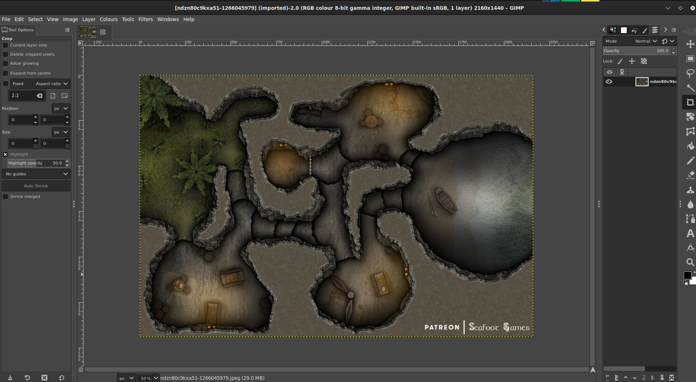
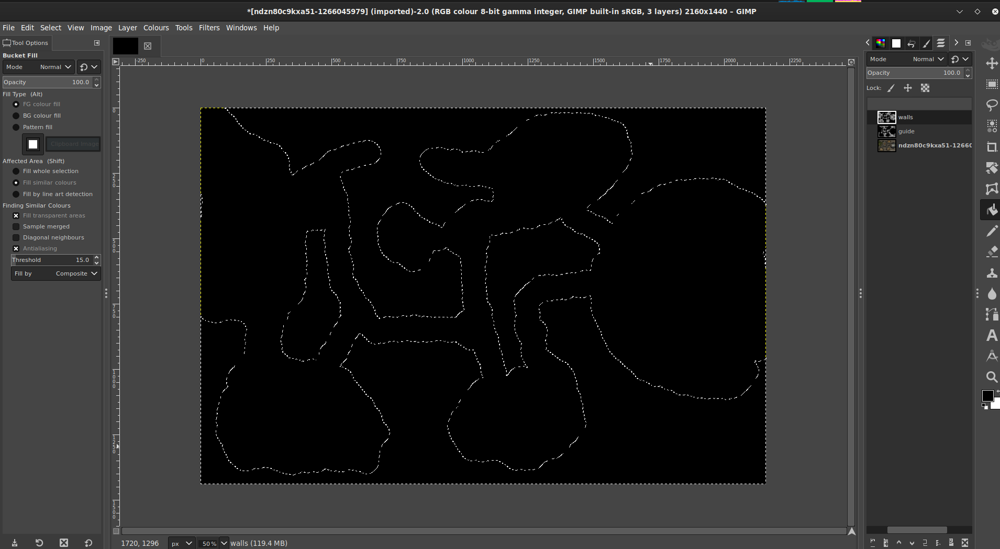

# **Руководство по стенным маскам**

Руководство предоставлено [@veritanuda](https://keybase.io/veritanuda)

Этот способ подойдёт для любой карты в зависимости от её качества, но даже нерегулярные карты, например пещеры, легко маскируются.

# Требования

Инструкции ниже рассчитаны на бесплатные инструменты [GIMP](https://gimp.org) и [potrace](https://potrace.sourceforge.net/). Вы, конечно, можете использовать коммерческие инструменты для достижения того же результата, но нет гарантии, что всё будет вести себя так же.

---

Ниже я покажу 2 способа.

- Первый способ — для подземелий и готовых карт
- Второй способ — для нерегулярных и собственных карт.

# **Способ первый**

Для этого способа я возьму случайную карту из Free Friday Maps. Их можно получить [здесь](https://www.drivethrurpg.com/browse/pub/10213/Paths-to-Adventure/subcategory/25973_33572/Free-Map-Friday), но подойдёт любая карта, главное, чтобы она обладала несколькими ключевыми характеристиками.

- У неё есть чёрно-белая версия, и
- у неё есть вариант без сетки.

    Это не обязательно, но позволяет немного сэкономить время при создании маски.

Итак, вот карта, с которой я начну.

Она доступна в нескольких вариантах, включая Lineart. Именно его мы и будем использовать.

# Удаление фона

На этой карте вокруг основного изображения есть нерегулярная штриховка, служащая фоном. К счастью, она другого цвета — серого. Выберите инструмент `Fuzzy select/Colour Select`, затем `Colour Select` и кликните по одному из серых участков фона — вы увидите, что весь серый цвет подсветился.

Это хорошо, но, поскольку линии между ними не выбраны, если удалить выделение сейчас, останется чёрная «рваная» заливка.

Когда всё выделено, кликните правой кнопкой мыши по изображению и перейдите в `Select` `>` `Grow...`

Расширьте выделение на несколько пикселей, пока оно не покроет линии между серыми пятнами. Когда вы убедитесь, что захватили всё, нажмите `Delete` — и _вуаля_, фон исчезает.

Теперь вернитесь к `Fuzzy Select` и на этот раз выберите именно `Fuzzy Select`. Кликните по теперь уже белому фону — и всё будет выделено.

- _Примечание: если на карте есть замкнутые области, как в нашем случае, удерживайте клавишу Shift и кликайте внутри, чтобы добавить их в выделение._

Теперь на панели `Layers` добавьте `New Layer`. Назовите этот слой `mask`.

На этом слое выберите инструмент `Bucket Fill`. Кликните по созданному ранее выделению фона — оно должно залиться чёрным.

Скройте слой с линейным рисунком и проверьте, что маска полная и без пропусков.

Если вы что-то пропустили, не паникуйте: нажмите `Cntrl-Z`, чтобы отменить действие, и снова выделите пропущенные ранее участки.

В зависимости от карты и способа выделения фона некоторые двери могут оказаться закрашенными. С помощью инструмента Erase и подходящей по форме кисти пройдитесь по всем дверям и потайным дверям и удалите чёрный цвет.

Если этого не сделать, дверь станет непроходимой. После импорта карты и добавления стен вы всегда сможете добавить жетоны дверей в созданные вами проёмы.

Когда маска вас устроит, можно удалить слой с линейным рисунком.

Следующий шаг **крайне важен**, если вы хотите корректно конвертировать маску в SVG — именно этот формат PlanarAlly использует для стен.

Кликните правой кнопкой по изображению и перейдите в `Image` `>` `Mode`. Если вы импортировали линейный рисунок, как я, он будет в режиме `greyscale`. Иногда цветную карту приходится переводить в `greyscale`, чтобы проще было удалять фон и т. п. Но теперь режим должен быть `RGB`. Переключите изображение на него.

Затем кликните правой кнопкой по изображению и перейдите в `File` `>` `Export As...`, сохраните изображение в формате `BMP`. Отключите `Run Length Encoding` и `Do not write colour space information` и убедитесь, что в разделе `Advanced` выбрано `32 Bits`.

После сохранения вы можете использовать `potrace` из командной строки или бесплатно сделать это онлайн на [этом сайте](https://svg-converter.com/potrace)

Команда очень проста.

`potrace -s FREE-MAP-FRIDAY-001_LINEART_WALLS.bmp`

В результате вы получите `svg`, который, если открыть его в графической программе, будет чёрным там, где свет блокируется, и прозрачным там, где свет может проходить.

# **Способ второй**

Предположим, у вас нерегулярная карта или фон удалить не так просто. Всё равно можно сделать маску вручную, используя обычные инструменты.

Для этого примера я использую [вот эту карту](https://www.reddit.com/r/FantasyMaps/comments/hrf51h/battlemap30x202160x1440pxcavejunglepirateoc/)

Импортируйте карту в GIMP.

Создайте новый слой и назовите его `guide`.

С помощью инструмента `Pencil tool` выберите кисть `Circle` и сделайте её чёрной. При необходимости измените размер. Убедившись, что выбран слой `guide`, начинайте закрашивать цветные участки карты **внутри** стен.

Когда все фигуры будут закрашены, создайте ещё один слой и назовите его `walls`.

На слое `guide` используйте инструмент `Select by colour` и кликните по созданной вами чёрной подложке. Затем инвертируйте выделение.

Затем на слое `walls` инструментом заливки залейте инвертированное выделение чёрным и заполните стены.

Когда всё готово, скройте предыдущие слои. Если вы убедились, что ничего не пропустили, удалите эти слои и сохраните изображение в формате BMP, как описано выше, чтобы конвертировать его любым из описанных способов.

# Импорт стен в PlanarAlly

Теперь загрузите этот SVG в папку `Assets` на PlanarAlly вместе с картой игроков и картой DM, если она есть.

Перетащите эти активы в нужное место: карта игроков — на слой MAP, а карта DM — на слой GM. На слое MAP кликните по карте правой кнопкой мыши, откройте Properties, задайте `Name` и в разделе `Advanced` отметьте `Blocks Vision/Light` и `Blocks Movement`. Затем перейдите на вкладку `Extra` и в разделе `Lighting & Vision` `>` `Upload walls` выберите SVG, который вы только что загрузили в активы. Ваши стены будут применены.

Проверьте результат с помощью жетона с источником света на слое `Token` — и вы почти закончили. Если есть двери или потайные проходы, их придётся вручную ограничить жетонами дверей или туманом войны — на ваш выбор. Но при удачном раскладе вам больше не придётся вручную создавать стены.

Приятной игры!

\*/}
