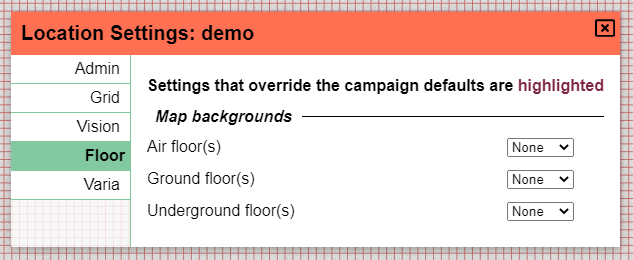
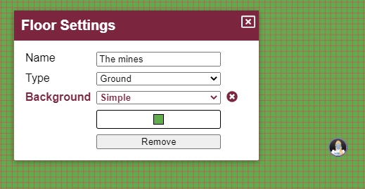

上一个版本是一次重大的技术变更，我很高兴看到过渡相当顺利，没有重大故障报告。本次发布又带来一项技术变更：将 js 构建系统从 vue-cli（webpack）改为 vite（esbuild + rollup）。这一变更对最终用户几乎没有影响，但会大幅提升构建速度！

除了技术变更外，还添加了一些体验改进，消灭了不少错误，而主要的新功能是为楼层设置背景颜色或平铺重复的图像。

## 楼层变更

楼层界面进行了些许精简，不再显示编辑和垃圾桶图标，而是改为齿轮图标，这与 PlanarAlly 中普遍用来表示设置的图标一致。

重命名和移除楼层现在通过这个新的楼层设置界面完成。

如果你熟悉楼层，你会注意到两个新设置。

_背景值得单独用一节来介绍，将在下文详细说明。_

本次发布引入了楼层类型的概念，包含一组预设选项：地下/地面/空中。

楼层设置可以像上面的界面所示，在楼层级别进行配置，未来还可以根据地点的层级或战役级别进行配置，这取决于楼层类型。

目前楼层类型唯一影响的地方是背景设置。未来我打算根据楼层类型添加一些自动性能改进。（例如，当你处于地面楼层时，不渲染较低的楼层。）

这仍然是我正在探索的一个想法，也许将来我会移除楼层类型的概念，代之以每个楼层的渲染设置。

## 背景填充

大多数情况下，DM 会准备好一张供玩家探索的地图。但有时也会出现即兴的支线探索，或者玩家因为发现了某些漏洞而走出地图边界。

在这些情况下，默认的白色背景就是他们活动的区域，这会有些单调。DM 当然可以添加其他地图或图像，但有时你只是想要一些能填补空白的东西。

正如前面提到的，现在可以为楼层配置背景。可以针对特定楼层，也可以针对同一类型的所有楼层。

### 纯色

最基本的选项就是设置单一颜色作为背景色。

这能以最小的努力快速提升沉浸感，营造出草地氛围。

### 图案

不过也可以将一张图像设置为背景，并在所有方向平铺重复，这样就可以使用无缝拼接的贴图集。

提供图像时，可以调整图案的偏移和缩放。

偏移是以像素为单位的值，用于相对网格移动图案。

缩放是影响图案大小的百分比。

## 体验改进

### 先攻

Release 0.26 彻底改版了先攻界面，本次发布在此基础上增加了一项小改进：当玩家拥有的角色正在行动时，该玩家可以推进先攻轮次。

### 工具栏

工具栏模式系统是常见的困惑来源，尤其是当前处于活动状态的是哪个模式。在过去的版本中，活动模式显示在工具栏右侧，只显示首字母。将鼠标悬停在字母上会显示完整名称。

很多人始终不确定它显示的是当前活动模式，还是点击后会激活的模式。

本次发布解决了这一困惑，在工具栏下方显示所有可能的模式，并高亮当前活动模式。

### 绘制辅助

丢失绘制工具的位置是另一个经常听到的抱怨。本次发布添加的一个非常小的改进是在画笔周围加了一圈对比边框，确保画笔在与背景同色时不会融为一体。

这绝不是解决丢失绘制画笔位置问题的完整方案，但这是第一个小步骤。

我在考虑，如果画笔小于某个尺寸，就在画笔周围添加一个更大的圆圈，但我还不确定人们是否会喜欢这个改动。

## 修复

### 颜色选择器

颜色选择器受上一版本技术变更的影响最大，因为我原来使用的组件还没有可用的 vue3 版本，所以我制作了自己的版本。

本次发布修复了：

- 按住鼠标时保持饱和度焦点
- 增加高度滑块
- 修复色相滑块点击后初始不移动的问题
- 恢复棋盘格背景
- 悬停在滑块上时显示 cursor\:pointer

### 标注

markdown 组件是另一个尚未移植到 vue3 的组件。不过，我为这个组件找到了另一个在 vue3 中提供 markdown 支持的开源工具。

不过，它默认禁用了一些我们在旧组件中习惯的渲染设置。尤其是现在能够重新渲染一组 HTML 效果。

### 其他

#### 绘制工具

选择不同颜色时，绘制工具光标不会立即更新其颜色。

#### 先攻

如果某个先攻条目还没有值，重新排序先攻条目时会抛出错误。

#### 共同 DM

现在无法再剥夺战役创建者的 DM 身份，也无法踢出创建者。

#### 素材

随着实验性 svg 支持的引入，出现了一个错误，导致素材（即用户上传的内容）的「阻挡视线」和「阻挡移动」属性不再起作用。

#### 笔记

切换地点时笔记部分会被清空。
