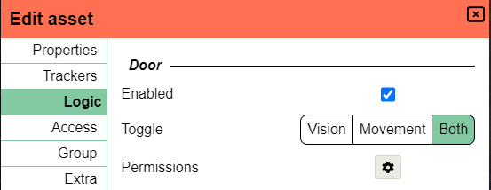
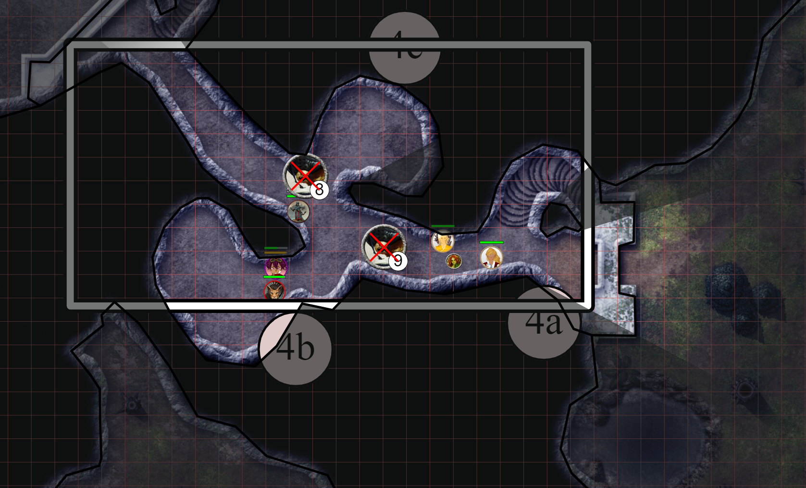

import Lock from "~icons/fa-solid/lock";
import Unlock from "~icons/fa-solid/unlock";

正如我在上一个版本中承诺的那样，我想更频繁地进行更新，即使它们没有添加很多功能。
本版本修复了大量错误，但同时也引入了一些新东西！

_服务器所有者：server_config 已做出更改，请查看 [服务器相关](#server-stuff)_

## 导入/导出

最引人注目的新功能是导入/导出功能。
导出功能在上一个版本中已经作为仅 API 的功能添加（即没有导出 UI），
但导入功能还没有定义。

_顺便提一下，得益于这个导出功能，我得以更快地解决一些错误！_

本版本带来了导入功能，以及导出和导入的 UI，这样终端用户也可以使用它们了。

### 实验性

我想强调，这个功能还不是最终形态，但考虑到它是一个非常小众的功能，
我觉得可以放心地让它供大家测试。

需要注意的事项：

- UI 非常简陋，导入/导出都只是一个按钮，没有任何进度信息。
- 也没有客户端错误信息
- 你不能导入一个与正在运行的战役同名的战役
- 你只能在一台运行与你导出时相同或更新版本的服务器上导入战役

前两点是未来版本中我要改进的内容。
第三点是 UI/UX 的问题，需要提供一种指定不同战役名称的方式。
最后一点是一个明显的技术限制，因为较旧的服务器不知道保存格式中发生了什么变化。

要解决这个问题，需要构建一个单独的服务，能够在任意版本之间升级/降级保存文件。这需要相当多的工作，所以不要太早期待它。

### 如何导出/导入

导出和导入功能都从主仪表盘访问，所以不在游戏中！

要导出你 DM 的战役，只需在"运行"区域点击一个战役，然后点击侧边栏中的"导出"按钮。
当导出完成时（如果服务器端没有失败），你的浏览器会提示下载文件。导出战役不是瞬间完成的，但也不会花太长时间。

导出战役的输出是单个文件，扩展名为".pac"，是 PlanarAlly Campaign 的缩写。
该文件包含导出战役中使用的所有资产，以及与战役相关的数据库中的所有信息。

要在另一台服务器上导入该战役，请转到导航侧边栏中的"导入"区域并点击简单的按钮。
完成后，你会被重定向到"运行"区域，导入的战役应该会出现在列表中。

导出和导入所花的时间与战役的大小（#地点、#楼层、#形状）以及这些战役中使用的资产大小成正比。

### 我什么时候会用到这个？

你可能会想知道这到底有什么用，我打赌大多数人只会使用 1 台服务器，永远不必担心导出/导入！

以下是一些潜在用例：

1. 你发现了一个错误，某些东西运行不正常，而且与我聊过之后仍不清楚是什么出了问题。
   这正是导出战役并发送给我的绝佳时机。这样我就可以利用自己的时间调试，而不必与你反复沟通。

2. 你喜欢自己做备份。你所使用的服务器总有可能出问题。保留备份对任何人都没有坏处。

3. 你即将在没有网络的地方进行游戏。快速导出你的战役，
   导入到你可以运行的本地服务器，砰的一声，你就可以从上次停下的地方继续游戏了。
   一旦你再次处于网络环境中，你可以再把它导入回来！

4. 你只是想换一个不同的 PA 服务器。

## 取色器

取色器有了一个有趣的新技巧，还有 2 个困扰我的修复 :D。

### 记住以前用过的颜色

取色器现在会记住你使用过的颜色（\*）。
它们显示在取色器底部，共 2 行（最多记录 20 种颜色）。你可以点击其中任意一种颜色来将其设置为当前颜色。悬停在列表中的颜色上也会显示该颜色的 rgba 值。

颜色历史按用户保存，跨所有战役。


（\*）当你关闭取色器时，颜色会被添加到列表中，*不是*通过绘制来添加。后者需要在整个代码库中添加代码，而现在可以把它包含在取色器逻辑中。

### 错误

取色器的 2 个错误也已修复。

#### 不透明度重置

点击颜色条（不透明度条上方的那条）时，不透明度往往会重置为 1 或 0，而不是记住当前的不透明度级别。

#### 饱和度面板返回红色

当先在颜色条上选择一种颜色，然后点击饱和度矩形时，颜色条往往会重置为最左边的值（红色）。现在这应该不会再发生了。

## 逻辑调整

逻辑是 2022.1 版本中闪亮的新事物之一，我们在这里就是要打磨一下这些新光彩！

### 门：图标清晰度

在 Play 模式下将鼠标悬停在门上时，会出现 <Lock /> 或 <Unlock /> 图标。
它只是一个黑色图标，在深色背景下很难看清。

本版本为图标添加了白色边框，这样它们应该始终可见。

### 门：指定阻挡项

门逻辑的第一个版本纯粹针对……门。
对于标准门，"阻挡移动"和"阻挡视线"属性应在打开或关闭时切换。
但也有门（例如吊闸）或窗户等变体，你可能只想切换 1 个属性。

你现在可以指定点击时门应该切换哪个阻挡项。



你当然仍然可以按自己的需要手动更改另一个阻挡属性。 \
（例如，让窗户使用门逻辑，只切换视线以模仿窗帘，但如果有人把砖头扔过窗户，则更改移动属性）

### 错误

与形状逻辑相关的多个错误已解决。

- Draw 工具门权限不保存
- 当形状属性打开时，门逻辑切换不会立即更新 UI
- 传送区从其他楼层触发
- 逻辑初始化边界情况会破坏 UI，直到刷新
- 逻辑权限选择器在边界情况下显示错误

## UI/UX 改进

在某些领域做了一些不错的更改，以改进 UX 和整体 UI。

### 更快显示加载动画

打开战役时会显示一个漂亮的加载动画。
但这个动画只在某个时间点才开始，取决于电脑，
打开战役时可能会有一小段时间似乎什么也没发生。

现在点击战役时会立即显示动画，这样就清楚了 PA 正在做一些事情，而不是你误点了。

### 随形状缩放的 defeat 与徽章

形状 defeat 覆盖层和形状徽章是固定大小的。
这意味着巨型生物的徽章非常小，而微型生物的徽章几乎遮住了棋子本身。
此外，使用不同网格大小时也会出现问题。

本版本正确地将这些元素随其所属形状的大小进行缩放。

### Firefox 上的弹窗处理

Firefox 对 dragEnd 事件的处理非常不一致/充满缺陷，这导致拖动的弹窗完全损坏。
其中部分怪异行为已在 Firefox 的 nightly 版本中修复，但并不是所有困扰我的问题都会在短期内得到修复。所以我将弹窗逻辑改为使用 drop 事件。这需要多一点代码，但至少能保证所有浏览器上的行为一致。

### 视口

显示玩家活动视口的矩形（启用时）使用了单一纯色，与门图标类似，根据背景颜色不同可能不太容易辨认。现在它也使用了第二种颜色来形成对比。



### 其他

- 在删除/离开战役提示中显示默认的"否"按钮
- 使用浏览器后退/前进按钮时，资产管理器会正确更新 UI
- 仪表盘导航标题有时样式错误

## 服务器相关

服务器端也有一些小更改，包括服务器配置的更改！

### 日志轮转

服务器现在会进行日志轮转，而不是只有 1 个大而无尽头的日志文件。

General 部分新增了两个属性：

```python
max_log_size_in_bytes = 200_000
max_log_backups = 5
```

有关它们作用的更多信息，请查看服务器配置中的文档。

### 导入分块大小

战役文件可能因为资产包含在文件中而变得很大。
为了避免必须把上传大小配置成某个荒谬的高数字（这会是安全风险），
客户端将改为以服务器接受的最大大小匹配的分块发送导入文件。

这个大小现在可以在 Webserver 部分配置，默认为 10 MiB。

```python
max_upload_size_in_bytes = 10_485_760
```

## 错误

### SVG 修复

针对形状附加设置菜单中 SVG 部分的几个修复：

- ExtraSettings svg 部分在切换标签页之前不会立即更新
- ExtraSettings 移除 svg 不能正常工作
- ExtraSettings 添加 svg 对没有先前 svg 属性的形状不起作用

### Undo/Redo 修复

- 调整大小操作时的 Redo 逻辑在吸附时不能记住正确的位置
- 当形状无效时，Draw 工具试图向撤销栈添加形状创建操作
- 移动和旋转的 Undo/Redo 不能持久化到服务器

### 其他

- 出生点加载错误
- 由多边形编辑 UI 修改的点在刷新之前不能吸附
- 资产 socket 没有清理过去的连接
- 当 FOW（战争迷雾）未开启时，作为光源的光环不再显示为黑色厄运圆
- 默认地点的缩放级别现在是 0.2，而不是 1.0
