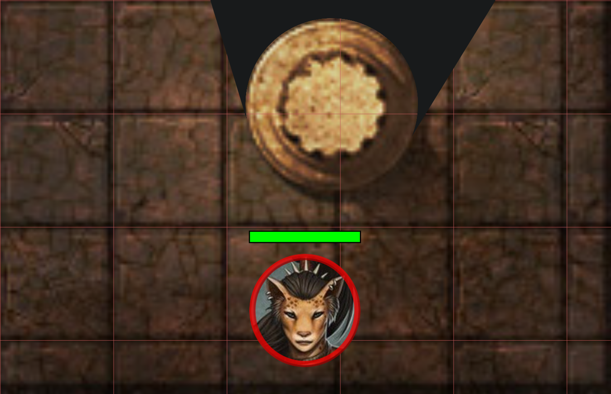
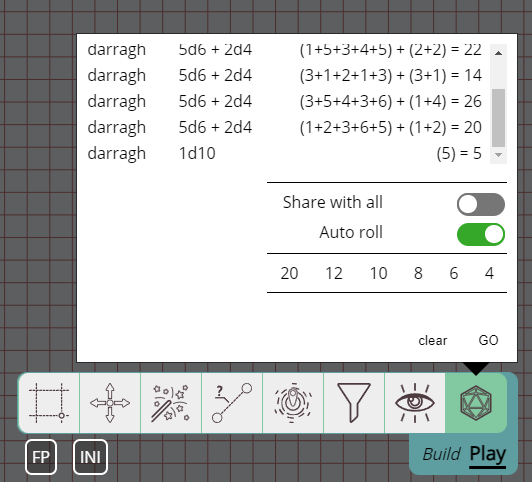

新的一年，新的版本！

和往常一样，修复了一些 bug，但这个版本的两个主角是对笔记系统的全面翻新，
以及引入一种能提升沉浸感的全新视线阻挡模式。

## 一种全新的视线阻挡模式

### 为什么我们需要额外的模式？

到目前为止，视线阻挡是一个非黑即白的东西：要么你可以看穿/看过去这个物体，要么它完全阻挡视线。
这在很多情况下都够用，但当遇到较小的物体时（例如树干、柱子、一块石头），
作为 DM 你往往就得做出选择。

- 完全遮住这个物体，得到正确的视线阻挡行为，
  但最终会失去沉浸感，因为玩家看不清那个阻挡视线的随机圆形到底是什么
- 让视线阻挡形状稍微小一点，露出一部分物体，但因此失去准确性

### 新模式

在这个版本中引入了一种新的视线阻挡模式，名为 `behind`。
它将与现有的视野模式一起使用，后者将被重命名为 `complete`。

当新模式启用时，被标记为视线阻挡的形状会被渲染成它不是一个视线阻挡形状的样子，
但它后面的所有东西都会被完全遮住。
例如，这样你就可以有一个阻挡视线的树干，
但仍然让玩家看到他们正在看的东西（也就是一棵树干）。

这个新模式的另一个好用处是门。
通过把它配置为 behind 阻挡，整扇门对象都能获得正确的视线，
让玩家更清楚他们看到的是什么。

**完全阻挡：**

**身后阻挡：**

#### 局限性

这种特殊模式只对封闭的形状有效。
在实践中，这意味着它适用于大多数常规形状（例如矩形/圆形），
但不适用于笔刷工具或文本形状这类特殊形状。

多边形可以是开放的，也可以是封闭的！
所以如果你想用多边形工具来显示一个不规则形状，
请确保你已将多边形标记为封闭。
（这是绘制工具中的一个选项）

另一个特殊情况是，放置在已启用此模式的物体内部的光源，
即使你的光环尚未覆盖到该形状，也可能被渲染出来。
这是实现中的一个边界情况，但在实践中应该不会造成太大问题，
因为没什么理由把光源放在视线阻挡形状内部。

## 笔记与注释

这个版本的另一大变化是对笔记系统的全面翻新。

到目前为止，PlanarAlly 有 2 种笔记概念：

- 松散的战役笔记
    - 有一个标题和一些自由格式的文本
    - 始终是私有的
    - 可以保持打开状态 / 随意拖动
- 形状笔记（称为注释）
    - 包含支持 markdown 的自由格式文本
    - 可以是公开的，也可以是私有的
    - 每个形状限 1 条
    - 当相关形状被悬停时，渲染后的 markdown 会显示在屏幕顶部

### 一系列问题

这两种概念各自都有问题，而且彼此不一致：

- 对于松散笔记
    - 无法搜索
    - 无法筛选（例如只显示与当前地点相关的笔记）
    - 无法与其他用户分享
    - 同一时间只能打开 1 条笔记
    - 完全没有 markdown 渲染
- 对于形状笔记
    - 无法同时拥有私有和公开的信息
    - 无法弹出查看，也无法在不选中形状的情况下访问
    - 如果你需要为某个形状写下的信息，你必须找到那个形状，不管它在哪
    - 除非它是角色，否则形状被移除时笔记也会丢失

### 一个统一的解决方案

为了解决这些问题，创建了一个统一的笔记系统。

在这个新系统中，形状笔记和战役笔记之间不再有区别。
笔记现在是一个单一的概念，可以附加到形状上，并通过一个名为笔记管理器（Note Manager）的新 UI 元素来管理。

### 值得注意的变化

关于新笔记系统的完整概览，请查看[笔记文档](/zh/docs/game/notes/)。
这份文档已更新以反映新系统，其中包含多张图片和更深入的讲解。

#### UI 变化

笔记管理器是一个新的 UI 元素，可以通过 <kbd>n</kbd> 快捷键打开，或点击左侧菜单中的笔记部分打开。
它是新笔记系统的核心，允许你管理所有笔记。

笔记管理器有一个搜索栏，可以让你搜索所有的笔记。
笔记现在还可以有任意标签，既可以用于搜索，也可以提供更多上下文。

不过你也可以从笔记管理器（以及其他一些地方）把笔记弹出来，在做其他事情时保持它们打开。
可以同时弹出多条这样的笔记，而且它们可以单独拖动。

此外，弹出的笔记还可以折叠，这样它们就只显示标题。
这适用于你需要在短时间内频繁访问的笔记，又不会让屏幕显得杂乱。

#### 访问权限

现在可以与其他用户分享笔记，并为他们定义精细的访问权限。

这意味着当某条笔记被调用时，你可以给所有玩家查看权限，也可以给某位特定玩家一条只有他能看到和编辑的私有笔记。

玩家创建的笔记是 PA 中少数 DM 不可见的东西之一！所以除非特别分享，否则这些笔记是真正私有的。

#### 形状

笔记可以按需附加到形状上。
一条笔记可以附加到多个形状，一个形状也可以附加多条笔记！

这样你就可以在同一个形状上同时附加公开和私有信息。

此外，还有一个新的笔记设置，可以配置一个笔记图标显示在形状上。
这有助于提醒你某条重要笔记的存在。
现在它还成为一个设置项，用来决定当相关形状被悬停时，笔记是否应该出现在屏幕顶部。
这个设置现在默认是关闭的！

当你选中一个形状时，屏幕右侧的快速信息区域现在也会显示附加到该形状的所有笔记的信息。
你可以快速悬停在笔记上查看它们的内容，也可以从那里把它们弹出来。

要查看某个形状的所有笔记概览，你可以点击快速信息区域中的笔记图标，或者使用所选形状的右键菜单。

#### 全局 vs 本地

创建新笔记时，你要选择它是全局笔记还是本地笔记。

这意味着全局笔记与战役无关，会在所有战役中可见。
而本地笔记则与当前战役相关，甚至与它创建时的具体地点相关。

由于全局笔记在每个战役中都可使用，
这意味着你应该注意不要创建太多，因为通常大多数笔记并非对所有战役都相关。

不过，全局笔记的一个好用途是数据卡（stat block）。你不想在每个战役中都重新定义某个特定怪物的数据卡。
结合[素材模板](/zh/docs/dm/assets/#templates)的使用，你可以在游戏桌面上放下一只哥布林，它会自动带上附加的数据卡。

## 素材投放比例（Asset Drop Ratio）

这是一个新功能，同时也算是一个 bug 修复。
它在地点网格设置中新增了一个设置项。

PA 有一个选项：当素材名称带有特定格式时，在投放时自动缩放。
例如 goblin_1x1 在正常情况下应该正好占满 1 个网格单元，dragon_3x3 则应该调整为 3×3 的网格单元。

现有实现错误地使用了一种基于 5 英尺体系的方法
来在地点尺寸更大时自动调整（例如 10 英尺的地图会自动让 something_2x2 适配进 1 个单元）。

但这对于一切不使用 5 英尺体系的情况都会完全出问题，无论是因为你使用国际单位制，还是你的系统使用某种自定义单位，又或者你乐于用披萨来定义尺寸。

简单的修复方法是禁用该系统，但那样的话，投放素材到不同比例的地图上就不再能正确工作。
为了同时解决这个问题，新增了一个设置：素材投放比例（Asset Drop Ratio），用来定义这些素材被投放到地图上时应如何缩放。

投放比例为 1 是默认值，意思是素材将完全按照其指定的尺寸调整大小（即 goblin_1x1 会占 1 个网格单元，即使它代表 10 英尺）。
投放比例为 0.5 则会把 something_2x2 调整为 1x1。

## 骰子历史

_由 SuikaXhq 贡献_

我有更大的计划要重做骰子 UI 和行为，但在慢慢推进的过程中，
SuikaXhq 对现有的骰子历史做了一个不错的改进。

骰子历史现在会更突出地显示是谁掷的骰子（以前只在悬停时显示），
并且包含更多关于具体这次投掷的细节，而不仅仅显示最终结果。

## 选择信息改进

_由 SuikaXhq 贡献_

如前所述，屏幕右侧的选择信息区域现在会包含附加到所选形状的笔记信息。

不过这并不是选择信息的唯一变化！

追踪器和光环会显示它们当前数值的信息，并提供这些数值的快速修改。
不过对于光环来说这并不太有用，在大多数情况下这并非你想频繁更改的东西。

这个版本把光环部分改为提供一个开关，用来启用/禁用光环，而不必打开详细的追踪器设置。
此外，如果光环的（角度）有限制（即不是 360 度），还会显示一个旋转滑块，让你可以快速改变光环的旋转。

## Bug 修复

- 多边形编辑 UI：未考虑形状的旋转
- 传送：未跟随传送的形状似乎不会移动，因为本地同步没有更新
- 骰子工具：如果没有输入任何内容，忽略 GO 按钮
- 角色：修复了一系列与变体有关的 bug
- 追踪器：增加最大高度和滚动，以修复追踪器很多时 UI 的问题
- 旋转滑块：修复同步问题
- 旋转滑块：修复在特定角度下滑块锚点无法吸附到轨道上的问题
- \[服务器\] 临时形状移动时“unknown”形状的日志刷屏
