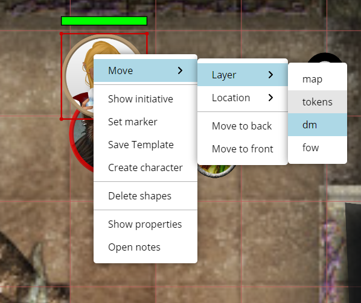

本次发布专注于网格，尤其是为六边形带来了一些关怀。

## 弃用通知

在进入正题之前，我想宣布：我打算在未来的某个时候移除标签/筛选系统。我*认为*这个功能并没有被广泛使用，而且它算是过去留下的遗迹。

未来可能会提供替代方案或其他选择，但目前的实现实在太过笨拙，不值得保留。

如果你确实在积极使用这个功能，请与我联系。

## 形状网格设置

「编辑形状」对话框中新增了一个名为「网格」的选项卡，用于配置与形状网格行为相关的一些新设置。

### 形状网格尺寸

将形状吸附到网格对 1x1 的形状来说效果很好。但当你有一个大于 1x1 的形状时，吸附行为可能会有些难以预测。这是因为 PA 必须对某个形状应当占据多少网格单元做出最佳猜测。

如果一个形状占据 75px × 75px 而网格为 50px，它应该吸附到 1x1 还是 2x2 的网格区域？答案取决于形状本身。也许它只是一个很大的美术素材，但只应占据 1 个网格单元；也可能它是一个用于更大生物的小素材。

本次发布通过提供显式指定形状应占据的网格尺寸的选项，赋予了你对此行为的更多控制权。PA 默认仍会根据形状的尺寸估算网格大小，但你现在可以覆盖这一设置。

### 显示网格占用

这是一个新设置，允许你显示形状当前占据的网格单元。你可以指定这些网格单元的背景色和边框色。

如果你的某些素材无法清楚地体现其大小，而你又想确保其影响范围清晰可见，这个功能会很有用。

### 六边形朝向

改进的六边形支持中，包括配置等尺寸六边形朝向的能力。

这类六边形有两种朝向，该设置可让你在两者之间切换。

## 六边形

PA 支持六边形网格已经有一段时间了，但它一直有点像是二等公民。除了渲染平顶或尖顶的六边形网格外，系统里没有其他部分会与六边形交互。这在实践中使用六边形时造成了大量问题。例如，将形状吸附到网格或点上时行为不正确，因为其逻辑仍然使用正方形表示。

本次发布旨在修复这一问题，让六边形在 PA 中成为真正的头等公民。

特别是吸附功能已更新，能够正确与六边形配合。这包括将点吸附到网格，以及将形状吸附到网格。

选择（Select）、绘制（Draw）、标尺（Ruler）和地图（Map）工具都已更新，以更好地支持六边形。

## 标尺工具：网格模式

另一个与网格相关的改动是，标尺工具现在新增了一个可启用的选项，名为「网格模式」。

在网格模式下，标尺不再测量两点之间的直线距离，而是沿网格测量距离。这应能解决在网格上测量大距离时的一些问题——你只关心经过的单元格数量，而不太关心以像素计的实际距离。

启用网格模式后，标尺会同时显示单元格数量和总距离。不过，你可以在客户端设置中配置此行为，只显示两者之一。

## 右键菜单界面更新

右键菜单的外观迎来了一次姗姗来迟的更新。

首先，界面有了更多空间，更易于阅读和浏览。

其次，随着菜单不断变长，新增了一些子分区。特别是所有与将形状移动到其他地方相关的操作，都被移到了一个新的「移动」分区中。

## 导出/导入

### 缺失的数据

上一版本实现的新笔记系统破坏了导出和导入功能。

本次发布修复了这个问题，以及其他一些我恰好忘记加入导出/导入系统的内容。特别是角色（Characters）、DataBlock 和笔记现在都能正确导出。

### 导入名称

导入战役时，你现在可以指定导入后的名称，而不必总是使用文件中的名称。

### 导入清理

对导入代码做了一些小改进。

当导入失败时，被导入的房间现在会被正确清理。

同时修复了导入代码可能运行两次的边界情况。

## 编辑形状：分组界面

「编辑形状」对话框中的这个选项卡已经有一段时间没有响应了。所做的更改不会立即更新，让人困惑它是否真的有效。

本次发布彻底重构了这一界面的内部实现，现在它应该响应迅速、按预期工作。这适用于所有与徽章相关的设置，也适用于向分组添加/移除成员。

## 较小的改动

### 笔记修复

新笔记系统总体运行良好，但有些小问题被报告并已解决。

- 打开形状笔记时筛选器未能正确重新运行，导致有时仍能看到上一个形状的笔记
- 进行形状筛选时，如果使用选择（Select）工具点击另一个形状，界面中的形状名称会发生变化。
- 在某些情况下，绘制在形状上的笔记图标可能会被绘制在形状后面。
- 修复仅有查看权限时「添加形状」和「移除形状」事件无法立即同步的问题
- 修复标注中包含原始 HTML 元素的 markdown 的渲染问题
- 模板上的笔记未能正确保存

### 吸附修复

选择（Select）和绘制（Draw）工具修复了一个小问题：某些操作（例如吸附到点、调整大小）会尝试吸附到正在移动的点上，导致看起来根本没有在吸附的怪异行为。

绘制工具在初次点击时也没有吸附到点上。

### 法术（Spell）工具

法术（Spell）工具内置了施放法术后返回选择（Select）工具的逻辑，但它对返回选择工具的要求有点过于强势。

手动选择其他工具时总是会被强制切回选择工具，这个问题已得到解决。

另一个小的体验改进是：当你试图输入小于 1 的数字时，尺寸输入框现在能更好地处理。

### 多边形包含检测

用于检测你是否点击了多边形的逻辑存在两个缺陷，现均已修复。

如果多边形重复使用某个点（由于某些自相交），包含检测代码会开始出现幻觉。

使用未闭合多边形时，首尾点之间的虚拟连线也会被视为多边形的一部分。

### 其他错误修复

- 将形状置前/置后时未能立即更新
- 修复了使用某些形状 ID 调用 Initiative.Order.Change 会失败的问题。
- 更改网格的客户端设置时屏幕不会立即更新
