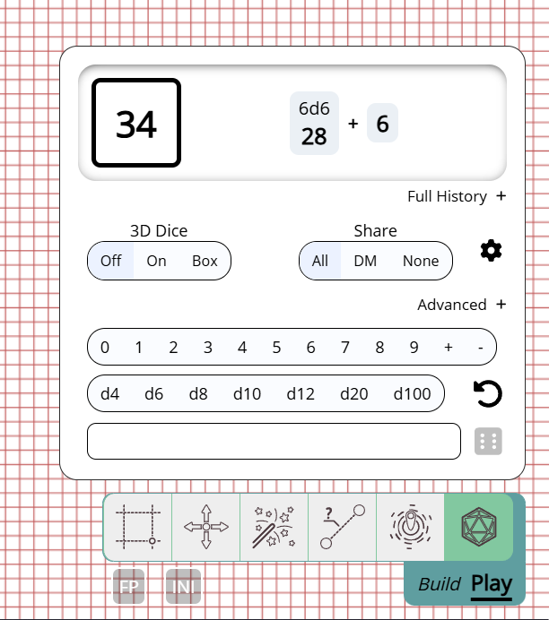

import Warning from "/src/components/directives/Warning.astro";

新的一年开始了，我们为你准备了一些很棒的变化！

<Warning title="服务器升级">如果你是服务器所有者，请查看与资产相关的变更，其中有 3 项与服务器相关的改动。</Warning>

## 已移除

本版本带来了一些清理工作，移除了 2 个功能：

### 标签/过滤器

正如最后 2 篇发布说明中宣布的那样，这组功能现已正式移除。

标签是你可以在形状上放置的标记，而过滤工具允许你根据这些标签筛选来隐藏/显示屏幕上的形状。
我仍然可以看到一些用例，但当前的实现并不理想，看起来很过时，而且据我所知根本没人使用。
自从发布弃用通知以来没有人联系我们，这一事实说明移除它们不会伤害任何人。

### .paa 文件

在 PA 的旧版本中，资产管理器可以选择将所有资产导出到一个 `.paa` 文件中，然后你可以在另一个 PA 安装中导入它。

从那以后，资产管理器进行了重构，其 UI 不再提供此功能。
我原本打算把这一功能带回来，但与此同时新增了导出战役的功能，它会自动导出所有相关资产。

这覆盖了原始 paa 设置的大部分用例。与其他移除一样，自那以后也没有人问过这个功能为何不再出现在 UI 中，
因此是时候清理一下了，因为为了本发布说明后面提到的一些改动，部分内部资产逻辑已被重写。

## 骰子

### 工具 UI

_由 rexy712 贡献_

在 2024.3 中，骰子工具获得了一个亮眼的新 UI，这已经比原始 UI 有了很大进步，但 rexy 决定进一步改进它。

新 UI 拥有流畅的过渡效果，并把掷骰结果直接整合进 UI，而不是打开一个单独的弹窗，从而减少了干扰。
此外，骰子历史记录得到了更好的集成，并新增了一个快速重掷上次结果按钮。

3D 骰子现在还可以在 2 种模式下投掷：默认和盒子。默认是原始行为，骰子在整个屏幕中投掷，
盒子模式则会在顶部打开一个类似小骰子托盘的小区域。

## 3D 骰子模拟的调整

_由 rexy712 贡献_

对 3D 骰子的物理属性进行了一些更改，应该会带来更好的表现，
特别是骰子现在应该会更快地停止滑动。

## D100 处理

D100 掷骰的处理在 2D 模式和 3D 模式之间差异很大，2D 模式涵盖 1-100 之间的所有数值，
而 3D 模式只处理十位数（例如 10/20/30/...），并且需要额外投掷一个 d10 来覆盖个位数，
但没有逻辑来处理例如掷出 00 和 0 时应该发生什么。

本版本对以上所有内容进行了改进。在 3D 模式下投掷 d100 时，会自动同时投掷一个 d10，
因此你不需要自己指定。此外，内置逻辑会决定 00/0 情况下的行为。

底层骰子库 `@planarally/dice` 可以配置为 0-99 或 1-100 模式。
不过当前的 PlanarAlly 界面不提供配置方式，因此目前始终选择 1-100 模式。

## 资产

另一大块变更与资产有关。服务器上做了一些技术更改，客户端也有视觉更新！

### 游戏内 DM UI

资产管理器是在游戏外整理资产、为一场游戏做准备的好方式。

然而在游戏中，DM 对资产的看法完全不同。
有一个带有树状结构的侧边栏，但除了把特定资产拖到地图上之外，没有真正的交互。

本版本改变了这一点，移除了侧边栏，用一个与新笔记 UI 有些相似的大型弹窗取而代之，
但其外观和感觉与游戏外的资产管理器类似。
事实上，游戏外和游戏内的资产管理器现在大部分 UI 共享相同的代码。

就像去年重构的笔记 UI 一样，资产 UI 可以从侧边栏打开，也可以通过快捷键 <kbd>a</kbd> 打开。

#### 搜索

侧边栏一直有一个搜索栏，新 UI 中仍然可用，并且实现得更加高效，
不再需要在连接到游戏时预先加载所有资产信息。

它的行为与侧边栏搜索略有不同，因为呈现方式完全不同。
它会直接显示所有匹配搜索的资产。而侧边栏则保持所有内部包含匹配资产的文件夹可见。

#### 快捷方式

另一个新功能是可以把某个文件夹标记为快捷方式。快捷方式会出现在左侧，位于永久快捷方式"所有资产"下方。
它们让你可以快速访问可能经常需要的特定文件夹（例如主要战役文件夹、常见的 dnd 棋子等）。

快捷方式按战役存储。

#### 拖放

你可能会想知道，既然新 UI 占据了中央屏幕很大一部分，现在应该如何把资产拖到地图上。

当你开始拖拽一个资产时，可以把它拖到某个文件夹上方以移动到该文件夹，就像在资产管理器中一样。
但如果你把资产拖出 UI，UI 会完全消失，让你可以实际将其放置在地图上。

为了确保清晰，拖拽时 UI 底部始终会显示一条消息，告知你这一行为。

<video autoplay loop muted style="max-width: min(680px, 75vw);">
    <source src="/blog/release-2025.1/asset-drop.webm" type="video/webm" />
    <source src="/blog/release-2025.1/asset-drop.mp4" type="video/mp4" />
</video>

### 较小的资产管理器更改

#### 重命名 UI

_由 rexy712 贡献_

重命名资产过去会打开一个需要输入新名称的弹出窗口。
现在这变得不那么突兀了，你可以像在操作系统的文件资源管理器中那样直接就地编辑名称。

#### 上下文菜单选择

在资产管理器中右键单击一个资产时，会弹出一个上下文菜单。
之前这总会把选择重置为仅你右键单击的那个资产。

现在不再如此，你可以正确地选中一批文件并通过上下文菜单删除它们。
当选中多个资产时，不会显示"重命名"之类的操作。

如果单击的资产一开始就不在当前选择中，选择将重置为仅该资产。

### 缩略图

资产可以以各种质量上传，当显示在地图上时，我们希望它们保持相同的质量。

但在一些与资产交互的其他地方，并不需要更高的质量，只会让事情变得更重。
资产管理器就是主要候选者，它可能一次性加载大量图像。

从本版本开始，服务器将尝试为所有上传的资产生成缩略图，并在资产管理器等处显示资产时优先使用这些缩略图。
这将使资产管理器加载更加流畅，因为它不必加载大量高质量图像。

<Warning title="服务器升级">
    启动服务器时，会有一个后台任务开始为所有现有资产生成缩略图。这会不时记录一些进程信息，但不会阻塞服务器的主要行为。

    如果缩略图不存在，也存在回退行为，因此这个过程不那么关键。

</Warning>

### 上传与存储限制

服务器所有者现在可以在服务器配置中配置全局的资产限制。
有两个新设置可用，一个用于限制单个资产的最大大小，另一个用于限制某个用户在服务器上所有资产的总大小。

这两个设置默认都没有限制，所以请确保将其修改为你想要的值。

需要注意的是，限制更改只适用于新上传的资产。
如果某个用户在设置加入之前使用了更多空间，他们的现有资产不会被删除，但他们将无法再上传更多资产。

<Warning title="服务器升级">
    这会在配置文件中添加新条目，请确保将这些条目添加到你的配置中，否则服务器将无法启动。
</Warning>

### 保存位置

_这是一个技术性的服务器更改，如果你是玩家可以跳过这一部分_

与上传资产关联的物理文件存储在磁盘上的特定文件夹中，所有文件名称都等于资产的哈希值。
到目前为止它们存储在一个扁平文件夹中，但出于性能原因，本版本将改为基于哈希的子文件夹结构存储。
这将降低一些 I/O 操作时间，因为它们不再需要在单个大文件夹中操作。

<Warning title="服务器升级">
    启动时会进行一次性的迁移，将所有现有文件移动到新位置。
    根据服务器上资产的数量，这可能需要一段时间。

    这个过程不能被中断，因为物理文件以及数据库中把它们链接在一起的记录都会被移动。

</Warning>

## 笔记

最后一组变更与笔记有关。不过其中大多数是较小的更改和错误修复。

### 完全弹出

随着新笔记 UI 的引入，笔记可以从笔记管理器中弹出，形成一个可以在 PA 屏幕内拖动的浮动笔记弹窗。

本版本使这个弹窗可以完全弹出页面，让你可以把笔记拖到另一个屏幕并继续与之交互。
这个浮动对话框仍然与打开的 PA 页面相关联，但不绑定到特定的屏幕位置。关闭 PA 标签页也会关闭浮动对话框。

### 全局笔记访问

全局笔记的默认访问权限已被移除。
以前这允许用户将笔记设置为对所有用户全局可见（甚至可编辑），这不是我们想要的行为。

### 小 UI 改进

- 你现在可以通过一个按钮清除笔记搜索栏。
- 本地/全局切换现在是一个下拉菜单，带有筛选所有笔记的选项
- 侧边栏中的笔记按钮现在对玩家也可见
- 没有写权限的笔记弹出窗口现在显示"查看源代码"而不是"编辑"

### 修复

- 修复了与只读访问交互相关的各种 UI 错误
- 修改搜索/筛选时笔记分页没有重置
- 笔记的默认编辑访问权限不能正常工作
- 搜索栏 UI 会与其他 UI 重叠
- 可以在本地编辑只读笔记（这些更改总是被服务器拒绝）

## Draw 工具默认颜色

当在 FOW（战争迷雾）图层上绘制时，我经常在墙、窗、门之间切换。
对于每一种，我都会使用特定的颜色，这样当我打开 FOW 图层时它们能立刻从视觉上区分开来。

到目前为止，这有点麻烦，因为你总是需要在不同种类之间切换时更改颜色，尽管颜色工具有最近使用颜色的记忆功能，
这仍然很繁琐。

现在这种情况得到了改变，新增了默认颜色功能，你可以在客户端设置中为墙/窗和门配置默认颜色。
在 Draw 工具中相关场景下会默认应用这些颜色。

为了明确传达这一点，当会使用默认颜色时，Draw 工具中的取色器会被禁用。
不过你仍然可以通过取消选中 Draw 工具视野设置（第 2 个标签页）中的"使用默认颜色"复选框来禁用此行为，并为特定对象选择特定颜色。

这是一个小补充，但已经为我节省了大量时间！

## 其他

- SuikaXhq 不辞辛苦地更新了大量 UI 中硬编码的英文标签，改用翻译标签
- 仪表盘新建游戏按钮的边框颜色已更新
- 修复了选择变更时的一些奇怪处理（例如更改形状名称后在离开名称输入框之前单击另一个形状）
- 拖动的弹窗现在也会获得焦点
- 传送复合形状可能导致一些客户端错误
- Select 工具的吸附行为现在与 Draw 工具吸附行为一致（即一旦吸附到一个点，在鼠标松开时不再吸附到网格）
- 点击一个与其他会话同名的会话会展开两个会话
