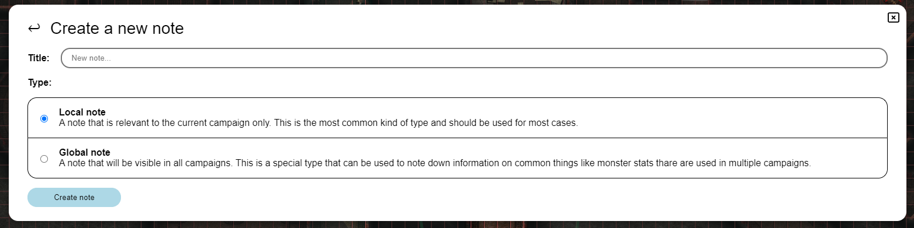
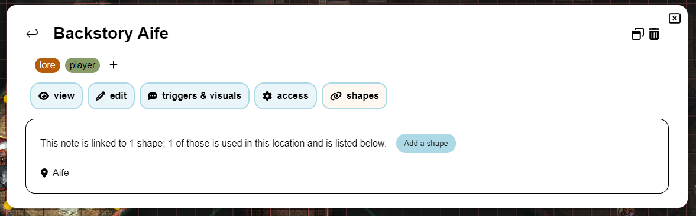

import Info from "/src/components/directives/Info.astro";
import Warning from "/src/components/directives/Warning.astro";

# 笔记

作为 DM 或玩家，你有时会发现需要针对某个角色、地点、事件等做笔记。
本页将展示 PlanarAlly 在笔记管理方面提供了哪些功能。

## 概念

从根本上说，所有笔记都是简单的容器，包含文本、一个可选的标题和作者。
但它们可以通过多种不同的方式使用。

笔记可以与其它玩家共享，或仅对笔记创建者保持私有。
笔记也可以附加到形状上，这样在选中该形状时就能快速访问笔记。
或者仅仅用来提醒自己关于该形状的某些信息。

笔记支持 Markdown 格式。更多信息请参阅 [Markdown 教程](../../../learn/dm/Markdown_Tutorial/markdown)

### 全局 vs 本地

大多数情况下，笔记只与当前的战役/地点相关。
但在某些边缘情况下，你可能想要一个与战役无关、可从任何地方访问的笔记。

前者称为本地笔记，后者称为全局笔记。
在创建笔记时，你需要决定要创建哪一种。

全局笔记的一个很好的例子是怪物的属性块。
如果将其与[素材模板](/zh/docs/dm/assets/#templates)结合使用，你就能把一个哥布林放到桌面上，
并附带一个包含其属性块的笔记。

## 笔记管理器 UI

笔记交互的核心是笔记管理器。
这是一个大型 UI 元素，支持搜索、筛选和创建笔记。

### 打开

点击屏幕左侧侧边菜单中的 “Notes” 区域即可打开笔记管理器。

也可以使用键盘快捷键 <kbd>n</kbd> 来打开/关闭。

最后，还可以通过形状上的右键菜单打开，
或者在选中形状时通过屏幕右侧的选择信息面板打开。
在这些情况下，笔记管理器会以筛选条件打开，仅显示与该形状相关的笔记。

### 主视图

这里显示当前可用的所有笔记列表（在应用特定筛选条件后）。

#### 搜索与筛选

第一个主要的 UI 元素是搜索栏，它允许你搜索所有笔记并对其进行筛选。

搜索栏包含一个用于切换本地和全局笔记的开关。
这些笔记通常在性质上差异很大，因此有各自独立的不同视图。

第二个元素是实际的搜索栏输入框，你可以在这里输入搜索查询。

PA 会将所有已知笔记与该查询进行匹配，并在下方列表中显示结果。
PA 在何处查找你的查询取决于所使用的筛选条件，
这可以通过搜索栏的最后一个元素来配置。

默认情况下，PA 会在笔记的标题和标签中查找你的查询。
不过可以修改为也在笔记内容和作者中查找。

PA 默认也只会查找在活动地点中创建的笔记。
这可以更改为查找所有非归档地点，甚至查找当前战役中的所有地点。

可以隐藏所有附加到形状上的笔记，
如果你希望专注于与整个主线剧情更相关的笔记，这会很有用。

最后一个可能的筛选条件是忽略本地/全局切换，以纳入附加到本地形状上的全局笔记。
本质上，这会包含当前地点中附加到形状上的所有笔记（无论本地/全局状态如何）。
（例如，如果当前地点有哥布林，那么哥布林的全局属性块也会出现在本地列表中）

##### 形状筛选

可以通过对形状使用右键菜单并选择显示笔记，或通过活动形状选择中的笔记区域，
将笔记管理器置于形状筛选模式。

此时，只会显示附加到相关形状上的笔记。
大多数搜索筛选条件会在此时消失/被禁用，因为它们不再相关。（请注意，附加到该形状的全局和本地笔记都会显示）

在此模式下，创建新笔记按钮也会自动将笔记附加到该形状上。

<Info>也可以在编辑视图的 “shapes” 选项卡中将笔记附加到现有笔记上。</Info>

#### 笔记列表

主视图的中间部分显示匹配搜索查询和筛选条件的每个笔记的标题、作者、标签以及一些快捷操作。

标题是一个可点击的链接，会在编辑视图中打开该笔记。

目前可用的 2 个快捷操作是编辑和弹出按钮。
编辑图标与点击标题一样会在编辑视图中打开笔记，
弹出图标会在单独的模态框中打开笔记。（更多信息请参阅[弹出笔记](#popout-notes)）

如果匹配活动筛选条件的笔记过多，此视图将分页显示。在这种情况下，右上角会出现 `<` 和 `>` 按钮。

### 创建新笔记

点击主列表视图中的创建新笔记按钮后，会出现一个新界面用于预配置新笔记。
在此视图中，你可以配置标题和笔记类型（全局或本地）。

之所以使用单独视图来完成，是为了留出空间来解释全局笔记和本地笔记之间的区别。

创建笔记后，你会自动进入编辑视图以进行进一步配置。

### 编辑视图

此视图是编辑笔记的高级模式。
如果你想返回主视图，可以按左上角笔记标题旁边的返回箭头。

编辑视图从上到下分为多个部分：

#### 标题

这里只显示笔记的标题。

如果你拥有该笔记的编辑权限，就可以编辑它。

右侧同样有一些快捷操作。
这里有一个[弹出](#popout-notes)图标和一个用于删除笔记的垃圾桶图标。

#### 标签

这里显示当前附加到笔记上的所有标签。

如果你拥有该笔记的编辑权限，就可以添加/删除标签。

标签是自由格式的，可以是任何你想要的内容，不过理想情况下应该相对简短。
PA 对它们唯一的使用方式就是用于筛选/搜索笔记，因此你可以随意组织它们。

标签会根据其内容自动分配一个一致的颜色。

<Warning>标签对所有拥有该笔记“可以查看”权限的用户可见。（参见 [访问选项卡](#tab-access)）</Warning>

_由于颜色生成使用 SHA1 算法，因此只在 HTTPS 环境下有效，在 HTTP 环境下会回退为偏灰的颜色_

#### 选项卡：查看与编辑

这两个选项卡协同工作，构成笔记的核心。

在“编辑”选项卡中，你可以用支持 Markdown 的文本格式编写/编辑笔记的实际内容。
实际渲染后的 Markdown 可以在“查看”选项卡中看到。

#### 选项卡：触发器与视觉

只有笔记附加到形状上时才能打开此选项卡。

它允许为笔记配置一些特殊行为。

目前它提供两个选项：

显示笔记图标：这会在形状旁边（在地图上）显示一个小图标。
可用于提醒自己有一条重要笔记。

悬停形状时显示文本：当你悬停该形状时，会显示笔记的（Markdown 渲染后的）内容。
它会出现在屏幕顶部中央。请注意，如果笔记很大，它可能会覆盖屏幕的很大一部分。

#### 选项卡：访问

此选项卡允许你配置谁可以查看和编辑笔记。

默认情况下，只有笔记作者可以查看和编辑笔记。
但你可能希望让所有玩家都能查看某条他们发现的笔记。

你还可以针对特定玩家进行细粒度的访问设置，从而与特定玩家分享隐藏的笔记。

重要的是要认识到，笔记的标签对拥有查看访问权限的玩家是可见的。
确保你不会因为类似 `faction:evil` 的标签而意外剧透某些内容。

<Info>
当你给予某位玩家（无论是特定玩家还是所有玩家）查看访问权限时，他们会收到一条新笔记可用的通知。

因此，作为 DM，只需授予笔记的查看访问权限，就是通知玩家们他们刚刚发现的特定信息的好方法。

</Info>

#### 选项卡：形状

此选项卡列出当前附加到笔记上的所有形状。

它会先列出所有战役中形状的数量总和，然后列出活动地点的数量总和。

对于活动地点，它还会列出所有形状及其名称。点击名称会将屏幕居中到该形状上。
将鼠标悬停在名称上还会显示一个垃圾桶图标，点击后会将笔记从该形状上分离。

## 弹出笔记

有时你需要频繁访问一条或多条笔记。
在这种情况下，不断打开笔记管理器并切换笔记是很麻烦的。

为解决这个问题，PA 提供了将笔记弹出到单独模态框中的功能。
可以同时打开多个模态框，并且可以单独拖动。

弹出框只提供查看和编辑功能，其它笔记设置需要打开笔记管理器本身。

也可以折叠弹出框，这会隐藏笔记内容而只显示标题。
如果你打开了多个弹出框，或知道某条笔记目前不再相关但不久后会用到，这会特别有用。

## 活动形状选择笔记

PA 总是在屏幕右侧显示一个 UI 元素，其中包含当前选中形状的一些快速信息。

该区域也有一个专门的笔记区。
它显示附加笔记的数量，以及一个立即打开笔记管理器并应用筛选条件以仅显示与该形状相关笔记的图标。（更多信息请参阅[形状筛选](#shape-filtering)）

如果该形状附加了 1 条或多条笔记，你还可以展开/折叠此区域以列出这些笔记。
这让你可以快速弹出笔记或在笔记管理器中打开它。
此外，将鼠标悬停在这些笔记上会显示笔记内容，并出现在屏幕顶部中央，不受其触发器配置的影响。
