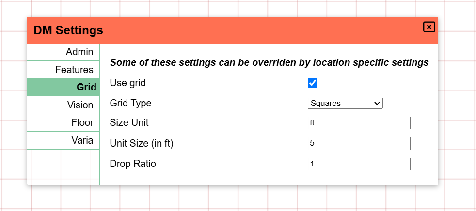
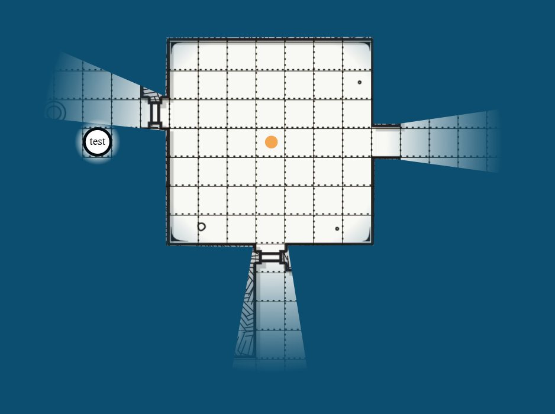
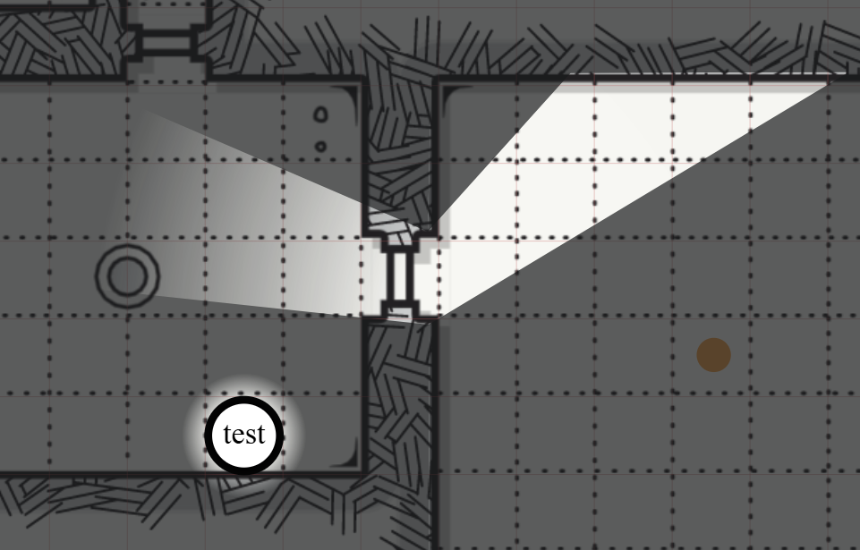

import Cog from "~icons/fa-solid/cog";
import Info from "/src/components/directives/Info.astro";
import Tip from "/src/components/directives/Tip.astro";

# 你的第一张地图

大多数游戏最终都会围绕一张地图展开，虽然并非总是如此，但在这些指南中我们将假设你打算进行传统的 dungeon 探索式的游戏设置。

在本指南中，我们将添加地图、配置墙壁、灯光、玩家角色和怪物。

## 配置

在开始正式工作之前，让我们先看看一些我们可能想要修改的配置。

打开左上角的 <Cog /> 并点击 "DM Settings"。
这将打开一个 UI，你可以在其中为整个战役配置各种全局设置。

### 管理设置

<Info>要给游戏添加玩家，你必须向他们发送邀请链接，你可以在该标签页上找到它！</Info>

不过与我们当前的准备工作更相关的是网格和视野标签页。

### 网格设置

根据你的游戏，这些默认值可能没问题，也可能需要一些调整。

这里有一些值得注意的地方：

- 默认使用方形网格，可以更改为六角网格
- 默认情况下，单个网格单元格被解释为各种事情的 5x5 英尺网格（例如 Ruler 工具）

### 视野设置

目前只需启用 "Fill canvas with FOW"。

我个人也喜欢把 FOW 的不透明度设得更高（例如 0.7），但这取决于个人喜好。
它将决定作为 DM，玩家看不到的那些区域对你有多明显。

我们为什么要启用这个 FOW 设置？

我们打算模拟一个深入地下的 dungeon 探索，所以默认设置很可能是所有地方都被黑暗覆盖，只有一些火把在这里或那里给场景带来光亮。
这就是我们为什么要用 FOW 填充画布。

配置好这些初始设置后，让我们关闭 DM 设置，实际添加一张地图。

## 添加素材

PA 有一个素材管理器，就像你的操作系统文件资源管理器一样，你可以在其中把上传的素材整理到文件夹中、重命名等。
一旦你有多个游戏，或者只是想一次上传大量棋子图片，你就会想好好探索一下素材管理器。

不过目前，我们只需从操作系统文件资源管理器中把一个素材拖到地图上。
如果一切顺利，你现在应该看到以下内容：

这里使用的地图是通过 [donjon dungeon generator](http://donjon.bin.sh/d20/dungeon/index.cgi) 随机生成的。

注意屏幕相当暗，这是因为我设置了 0.7 的不透明度。现在如果玩家加入会话，他们会看到一片纯黑的屏幕。

## 图层插曲

如果你也跟随了玩家指南，你可能会注意到左下角有额外的 UI，而玩家看不到这些。
这就是你控制楼层和图层的地方。楼层是一个更高级的话题，我们暂时跳过，但图层是 DM 工具箱中的必备工具。

图层在垂直方向上相互堆叠，用于提高渲染性能，也用于实现关注点分离。

默认选中的图层是 "token" 图层。所有普通棋子（无论是玩家、npc 还是怪物）都应该放在这里。
这是唯一一个玩家可以实际交互的图层。

作为 DM，你可以访问更多图层。token 图层左边是地图图层。这是最低的图层，想法是把大型地图元素放在这里。
这确保任何形状都不会卡在地图图片后面，或者你意外移动了地图素材本身。

第三个图层是 DM 图层，这只是你作为 DM 存放任何不想让玩家看到的东西的地方。
也许你有一个隐藏的怪物，只想在合适的时候才揭露，或者你在某些位置添加了一些文字作为提醒。

最后一个图层是 Vision 图层，我们很快会用到它，但目前你只需要知道这是通常用来画墙壁之类东西的地方。

### 移动我们的地图

我们刚才学到的其实是，我们之前添加的地图在错误的图层上！

我们可以删除地图，切换到地图图层，然后重新添加地图，但那样太费劲了。

相反，右键点击地图素材。（确保你仍然在 token 图层！你不能直接与另一个图层的素材交互）

在这里我们可以把选中的形状移动到不同的图层！
这也是让 DM 图层上那个隐藏怪物出现在 tokens 图层上的方法。

<Info title="隐藏的图层">
    实际上还有一个图层，一个你不能选择的图层：grid 图层。grid 图层被紧紧地夹在
    地图图层和 token 图层之间，只能从我们之前看到的 DM 网格设置中配置。

    注意，当地图在 token 图层时，网格线被隐藏在地图后面，而现在它们实际上覆盖在地图上方！

</Info>

## 设置灯光

好的，我们把地图放在了正确的图层上，让我们点亮它！

任何形状都可以作为光源，所以让我们从画一个小圆圈开始，表示某个房间里的火把。

### 基础形状

要绘制形状，我们需要使用 Draw 工具，它是工具栏 Build 模式中的工具之一，因为它主要在会话准备期间使用。
所以我们把模式切换为 build 模式（记住 <kbd>tab</kbd> 快捷键）并选择 Draw 工具。

选择一个圆形（或其他形状！）、一种颜色，然后把它画在游戏桌面上。形状通常通过用鼠标左键点击并拖动来绘制。

<video autoplay loop muted style="max-width: min(680px, 75vw);">
    <source src="/learn/dm/add-light-shape.webm" type="video/webm" />
    <source src="/learn/dm/add-light-shape.mp4" type="video/mp4" />
</video>

### 添加光源

我们现在可以打开刚绘制的形状的属性，并添加一个光源！

这可以在 Trackers 标签页中完成，通过配置一个充当光源并且是公开的光环。

请随意摆弄这些设置！两个范围值分别代表明亮和昏暗光照范围。
你可以不画完整的圆，而是把光源限制为一个锥形，并向特定方向倾斜。

你还可以给光一个特定的颜色，让它更有真实火把的感觉。

<video autoplay loop muted style="max-width: min(680px, 75vw);">
    <source src="/learn/dm/add-light-source.webm" type="video/webm" />
    <source src="/learn/dm/add-light-source.mp4" type="video/mp4" />
</video>

## 修正地图尺寸

既然我们添加了一个半径应为 40 英尺的光，你可能会想知道这与地图尺寸有什么关系，因为我们只是把地图图片拖到游戏桌面上，没有做任何额外修改。

如果你用 Ruler 工具测量地图上单个网格单元格的大小，你就会证实你的猜测：地图根本没有被正确缩放！
地图与 PA 网格的错位可能也早已暴露了这一点 ;)

我们可以尝试使用 Select 工具手动修正地图尺寸并缩放地图（在 build 模式下）。
然而这既容易出错又繁琐。相反，我们将使用只有 DM 才能访问的构建工具：Map 工具。

这个工具让你配置地图的尺寸。你可以按预期的网格单元格数量或预期的像素宽度/高度输入完整宽度/高度，
但你也可以拖出一个区域，并配置该区域应该代表多少个网格单元格。我觉得后者最容易。

<video autoplay loop muted style="max-width: min(680px, 75vw);">
    <source src="/learn/dm/map-tool.webm" type="video/webm" />
    <source src="/learn/dm/map-tool.mp4" type="video/mp4" />
</video>

在上面的视频中，我们执行了以下步骤：

1. 切换到地图图层（因为我们想与地图形状交互）
2. 选择地图，并切换到 Map 工具
3. 在地图形状上拖出一个区域
4. 在 Map 工具中输入拖出的区域应代表的水平和垂直网格单元格数量
5. 我数了拖出的水平单元格数量，是 5，并把它输入到水平字段中
6. 在输入数字之前，我点击了链式图标，这确保了任何编辑都会自动更新另一个字段以保持宽高比
7. 结果垂直字段约为 ~5.02，看起来没问题
8. 点击应用后，地图形状立即被调整大小以符合我们的约束
9. 但它仍然错位，所以我们回到 Select 工具，把它拖到与 PA 网格（红线）重叠的位置

这可能感觉相当复杂，但一旦你掌握了它，这实际上是一种相当快速的对齐地图的方法。

<Tip title="小贴士">
    1. 如果你拖出一个更大的区域，精度会提高！只是数你选中的网格单元格的数量可能要多花些功夫。
     
    2. 我的网格轮廓相对较淡，你可以在客户端设置中更改这一点  
    3. 即使最终结果并不完美，在总体尺寸大致正确的情况下，你应该能更容易地把地图调整到更精确的匹配
</Tip>

## 添加墙壁

我们现在有了一张正确对齐的地图和一盏灯，但灯只是忽略我们的地图。
要解决这个问题，我们需要告诉 PA 墙壁在哪里。

<Info>
    有一些更高级的选项，比如上传包含墙壁信息的 svg，可以帮助你完成这个过程。 （虽然我个人大多数时候只是手动画墙壁）
</Info>

与灯一样，墙壁也将使用 Draw 工具绘制。
主要问题是我们想在哪个图层上绘制它们？

虽然有一个最佳选择，但实际上我们可以选择任何图层，除了 DM 图层，因为那些对玩家不可见。

我们可以把它们画在地图图层或 token 图层上，但 Vision 图层有一些生活质量改进，使它更有吸引力：

首先，Vision 图层上的形状在其他图层时不会被渲染，这意味着大量墙壁形状等视觉噪音在实际游戏时可以隐藏起来。
这也意味着你可以给形状配色来表达特定含义（例如橙色的墙壁片段是暗门），而不必担心这些颜色渗入主场景。

第二个好处是，当你选择 Vision 图层时，Draw 工具会自动启用一些设置：

如你所见，`blocks vision/light` 和 `blocks movement` 设置会自动启用。
这是一个小小的便利帮助，使配置墙壁更容易一些，因为你不需要每次想画墙壁时都记得配置这些设置。

这两个设置相当重要，并且可以在绘制后更改。顾名思义，光线和移动将穿过这个形状被阻挡。
这通常是你对墙壁想要的！如果我们想模拟一扇窗户，我们会想保持 `blocks movement` 启用，但禁用光线和视野阻挡。

<Info title="默认颜色">
另一个便利功能是 Vision 形状的默认颜色设置。
可以在客户端设置的 Appearance 标签页中配置：
 

形状在相关时自动使用这里定义的颜色。（例如，两个 block 设置都启用的形状充当墙壁，而只阻挡移动的形状充当窗户）。

如果你想以特定颜色而不是默认颜色绘制这些形状，可以取消勾选 Draw 工具视野设置中的 'Prefer default colours' 选项。

</Info>

排除所有这些之后，让我们实际绘制我们的墙壁！你可以使用任何形状，但 polygon 工具是绘制墙壁最通用的。

<video autoplay loop muted style="max-width: min(680px, 75vw);">
    <source src="/learn/dm/draw-walls.webm" type="video/webm" />
    <source src="/learn/dm/draw-walls.mp4" type="video/mp4" />
</video>

如你所见，绘制墙壁非常简单！想向玩家展示多少实际的墙壁是一个风格偏好问题，
我通常喜欢给他们展示一点，让他们在视觉上看到那里有一堵墙，而不是只依赖阴影。

<Tip>
    你需要右键点击才能完成多边形！
     
    不要太担心不直的线条或忘记添加的点。Build 模式下的 Select 工具
    允许你移动多边形上的点，也可以添加新点或删除现有点。先画出大框架，之后再做些修饰，通常要快得多。
</Tip>

检查一下效果，例如现在转到 token 图层，你会注意到绘制的墙壁形状消失了，但阴影还在！

## 添加角色

我们现在有了一张带一些墙壁的地图和光源，但还没有角色。没有任何东西代表玩家，也没有怪物或 npc。

我们可以像处理地图一样拖放一些棋子到游戏桌面上。不过对于这个示例设置，我们将在 PA 内部创建一个基础角色棋子。
这些是只有文本标签的小圆形棋子。非常适合快速原型，或者当你需要在桌面上快速放一个 npc，又不想浪费时间在会话中寻找某个素材时。

要添加基础角色棋子，右键点击桌面上的空白处。理想情况下我们在 token 图层上做这件事！

<video autoplay loop muted style="max-width: min(680px, 75vw);">
    <source src="/learn/dm/basic-token.webm" type="video/webm" />
    <source src="/learn/dm/basic-token.mp4" type="video/mp4" />
</video>

在上面的视频中，我们：

- 创建一个名为 "test" 的基础棋子
- 给用户名为 "test" 的玩家这个形状的权限
- 把它拖来拖去测试墙壁是否有效，确实有效！

如果我们现在检查用户名为 "test" 的玩家能看到什么，我们会注意到以下问题：

我们的玩家可以看到有灯光的房间里的所有东西，而他们的角色甚至不在里面！

### 视野权限

在深入探讨视线和视野之前，我们需要快速绕道谈谈形状的权限级别。

当我们在上面给 'test' 玩家添加形状权限时，3 个访问权限（编辑/移动/视野）被自动授予。
这 3 个访问权限并不总是立即授予，这取决于一些上下文，所以认识到它们的作用很重要。

特别是视野访问权限很重要，因为它决定了玩家能看到什么。
启用该权限后，PA 将假定玩家可以访问形状的私有光环，并且本质上能看到该棋子在世界中能看到的东西。

即使棋子上没有配置光环，他们周围也总会有一个最小的视野光环，这样当你在一个看不清的地方移动时就不会丢失他们。

如果你禁用棋子的视野权限，我们反而会看到以下内容：

所以即使我们有编辑和移动权限，我们实际上也看不到形状，因为目前没有任何东西照亮该形状所在的区域。

## 视野

如前所述，玩家能看到被那盏灯照亮的房间，而他们的角色却不在那里，这有点奇怪。
这是因为我们目前没有对玩家应用任何视野限制。他们可以看到所有（公开）照亮的区域。

这在某些设置下是可以的，但当你期望玩家只能看到他们角色能看到的东西时，
这会变得非常繁琐，因为你作为 DM 必须在他们探索地图时打开或关闭灯。

而且这种费力的方式最终仍然会让玩家看到其他玩家所看到的内容，这可能也不是你想要的。

要真正按角色启用视野，我们需要两件事：

1. 玩家需要对其形状拥有视野权限
2. 地点需要配置为启用视线

(1) 我们在前面的视野权限部分已经讲过了，所以那部分已经完成，但对于 (2) 我们需要回到我们的 DM 设置，[我们之前在那里启用了 "full FOW" 设置](#vision-settings)。

<Tip>
如果你有多个地点（见后文），这些 DM 设置通常也可以按地点配置。

DM 设置是默认设置，当没有被地点明确覆盖时将被使用。

</Tip>

如果一切顺利，我们现在有以下视图（在 DM 这边）：

这里发生的是，玩家现在只看到那些在他们的视线范围内、根据我们绘制的墙壁有光的地方。
（记住我们只在右边的房间画了内墙）。

为了帮助你理解为什么会这样显示，我画了这幅粗略的示意图：

- 红线是我们画的墙壁，它们阻挡光线。
- 黄线显示光发出的锥形，穿过我们在墙壁上留下的门口
- 绿线显示角色通过同一个门口能看到另一个房间的锥形

对于角色所在的房间：

- 角色可以看到整个房间
- 光只照亮一个部分（那个黄色锥形）

-> 实际上只有锥形部分可见

对于光所在的房间：

- 角色只能看到绿色锥形部分
- 光照亮了整个房间

-> 实际上只有锥形部分可见

### 玩家光环

通常角色会有一些天生的能力，可以透过黑暗看到一定距离，或者他们只是有一些像火把这样的物体来提供光。

我们[之前](#add-light-source)看到如何为另一个房间的灯创建光环，我们只需为我们的玩家角色做同样的事情！
打开形状设置，转到 Trackers 标签页并添加一个新的光环。

配置为公开的光环会对所有玩家可见（具有该光环视野的玩家），所以这对火把来说很完美，而私有光环更适合黑暗视觉这样的天生能力。

标记 'acts as light source' 属性很重要，因为这才是让它真正作为光/视野源工作的关键。（视野源可能是一个更好的名字）

--

这应该能给你准备好地图以供游戏所需的基础知识！

[接下来](/zh/learn/dm/other-features)我们将了解一些你作为 DM 可能会想知道的其它功能。
