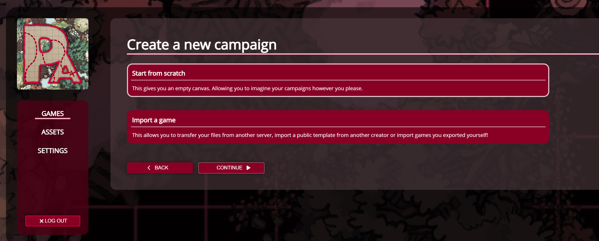

import Info from "/src/components/directives/Info.astro";

# 简介

在一个新的 VTT 上入门总是一个不小的挑战，因为每个平台都有自己的细微差别和功能。
本系列指南的想法是帮助你掌握准备和主持一场游戏时最常见的基本流程。

你最好先读一遍[玩家指南](/zh/learn/player/intro/)，它相当短，因为这里不会重复其中讲解的一些基础内容（例如移动镜头等）。

## 选择服务器

重要的第一步实际上是选择你打算在哪个 PA 服务器上运行你的游戏。
你可以自托管，也可以加入现有的开放服务器，选择权在你。

关于这一选择的更多信息，请参见[服务器文档](/zh/server/setup/)。

## 创建游戏

选好服务器之后，让我们来创建一个游戏。
如果你登录后访问主游戏概览，右上角会有一个大大的 NEW GAME 按钮。

这将弹出一个选择，要么从头创建一个游戏，要么从另一个服务器导入游戏。

<Info>这也意味着你实际上可以导出你的游戏！如果你最终想迁移到不同的服务器，这完全可行。</Info>

由于我们要创建一个新战役，我们将从零开始，继续吧。
选择一个名字，可选地添加一个标志，然后出发。

创建游戏后我们看到的第一件事是一张还没有任何内容的大白画布。
这显然是我们需要解决的问题，我们将在[下一章](/zh/learn/dm/first-map/)中做到。
