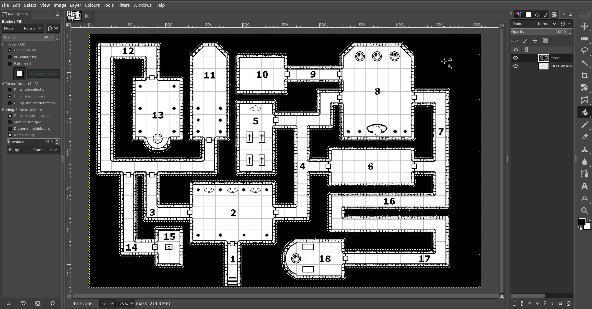
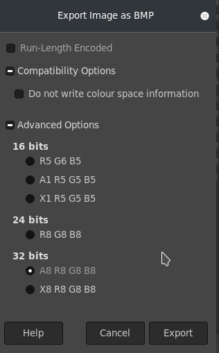
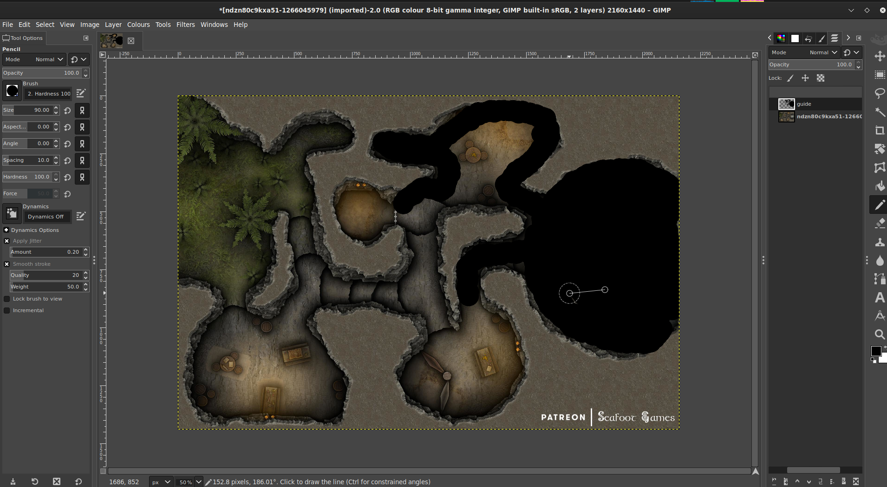

# **构建墙体遮罩指南**

指南由 [@veritanuda](https://keybase.io/veritanuda) 贡献

此方法应适用于任何地图，具体取决于其保真度，即使是像洞穴这样不规则的形状地图也可以轻松遮罩。

# 要求

以下说明使用免费可用的工具 [GIMP](https://gimp.org) 和 [potrace](https://potrace.sourceforge.net/)，你当然可以使用专有工具达到同样的效果，但不能保证它们的行为方式相同。

---

下面我将展示 2 种方法。

- 一种方法适用于地牢和预制地图
- 另一种方法适用于不规则地图和自定义地图

# **方法一**

对于这种方法，我将从 Free Friday Maps 中选择一张随机地图。你可以[在这里](https://www.drivethrurpg.com/browse/pub/10213/Paths-to-Adventure/subcategory/25973_33572/Free-Map-Friday)获得，但任何地图都可以，只要它有几个关键特征。

- 它有黑白版本，而且
- 它有免网格选项。

    这些不是必须的，但只是让制作遮罩不那么耗时。

所以这是我要开始使用的地图。

它有几个版本，包括 Lineart。这是我们将要使用的。

# 移除背景

这张地图周围有一些不规则的斜纹作为背景。幸运的是它是一种不同的颜色，一种灰色。所以选择 `Fuzzy select/Colour Select` 工具，选择 `Colour Select`，点击背景的一个灰色区域，你应该看到所有灰色部分都被高亮。

这很好，但是，因为它们之间的线没有被选中，如果我们现在删除它们，只会留下黑色的碎石般的外观。

所以在所有内容都被选中的情况下，右键点击图片，进入 `Select` `>` `Grow...`

将选区扩大几个像素，直到它覆盖灰色区域之间的线。一旦你满意你已经抓住了所有内容，按下 `Delete`，_呼_，背景消失了。

现在回到 `Fuzzy Select`，这次选择 `Fuzzy Select`。点击现在白色的背景，看到所有内容都被选中。

- _注意，如果有封闭的空间，就像这张地图一样，你需要按住 shift 键并点击它，才能把它加入选区。_

现在在 `Layers` 面板中添加 `New Layer`，把这个图层命名为 `mask`。

在那个图层上选择 `Bucket Fill` 工具。点击你之前做的背景选区，它应该会把它全部填充成黑色。

隐藏线稿图层，检查你是否有一个没有缺失部分的完整遮罩。

如果你确实遗漏了什么，不要慌，只需按 `Cntrl-Z` 撤销，回去选择你之前遗漏的部分。

根据地图和你选择背景的方式，一些门可能也会被涂上。你需要用橡皮擦工具和任何形状最合适的笔刷，把所有门和暗门上面的黑色擦掉。

如果你不这样做，你会让门无法通行。你总是可以在地图导入并添加墙壁后，为你做的任何开口添加门棋子。

一旦你对你的遮罩满意，你就可以删除线稿图层。

如果你想把遮罩正确转换成 SVG（也就是 PlanarAlly 用于墙壁的格式），下一步是**至关重要的**。

右键点击图片，进入 `Image` `>` `Mode`，如果你像我一样导入了 Line art，它应该是 `greyscale`（灰度）。有时你需要把彩色地图转换成 `greyscale`，以便更容易删除背景等。但现在模式必须是 `RGB`。把图片改成那个。

然后右键点击图片，进入 `File` `>` `Export As...`，把图片保存为 `BMP`。关闭 `Run Length Encoding`，关闭 `Do not write colour space information`，并确保在 `Advanced` 下是 `32 Bits`。

保存之后，你可以使用命令行 `potrace`，也可以在这个[网站](https://svg-converter.com/potrace)上免费在线完成。

自己执行的命令非常简单。

`potrace -s FREE-MAP-FRIDAY-001_LINEART_WALLS.bmp`

这应该会给你一个 `svg`，如果你在图形程序中打开它，它应该是黑色的，光会被阻挡的地方是黑色，光可以照到的地方是透明的。

# **方法二**

假设你有一张不规则的地图，或者背景不容易去除。好吧，你仍然可以只用普通工具手工制作遮罩。

对于这个例子，我将使用[这张地图](https://www.reddit.com/r/FantasyMaps/comments/hrf51h/battlemap30x202160x1440pxcavejunglepirateoc/)

把地图导入 gimp。

创建一个新图层，命名为 `guide`。

使用 `Pencil tool`，选择 `Circle` 作为笔刷并把它设为黑色。按需调整大小。确保你选择了 `guide` 图层，开始在墙壁**内**的彩色部分上绘制。

一旦你满意你已经填满了所有形状，创建另一个名为 `walls.` 的图层。

在 `guide` 图层上使用 `Select by colour` 工具，点击你制作的黑色引导线。然后反转选区。

然后在 `walls` 图层上使用桶填充工具，用黑色填充反转的选区并填满墙壁。

完成后隐藏之前的图层，如果你满意没有遗漏任何地方，删除这些图层，并像上面那样把图片保存为 BMP，用上述任一种方法转换。

# 将墙壁导入 PA

现在把这个 SVG 上传到 PlanarAlly 的 `Assets` 文件夹，连同玩家地图和 GM 地图（如果有的话）。

把这些素材拖到一个地点中，玩家地图放在 MAP 图层上，GM 地图放在 GM 图层上。在 MAP 图层上右键点击它，打开属性并设置一个 `Name`，在 `Advanced` 下勾选 `Blocks Vision/Light` 和 `Blocks Movement`。然后进入 `Extra` 标签页，在 `Lighting & Vision` `>` `Upload walls` 下。选择你刚上传到素材的 SVG。你的墙壁现在应该被应用了。

在 `Token` 图层上用一个有光源的棋子测试它，你就快完成了。现在如果有门或暗门通道，它们必须用手动用门棋子或 FOW 隔离开来，由你选择。但如果一切顺利，你就不用再担心手工制作墙壁了。

游戏愉快！

\*/}
