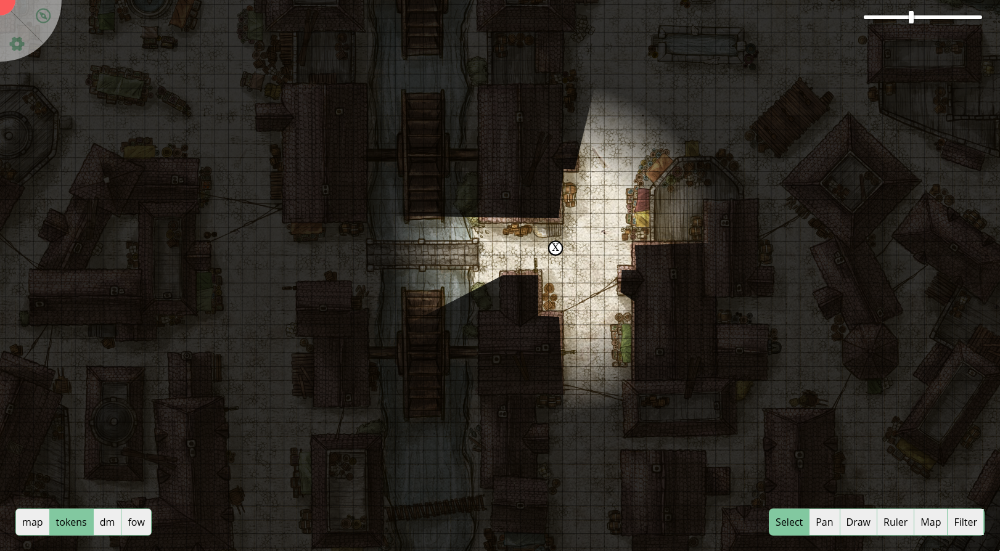
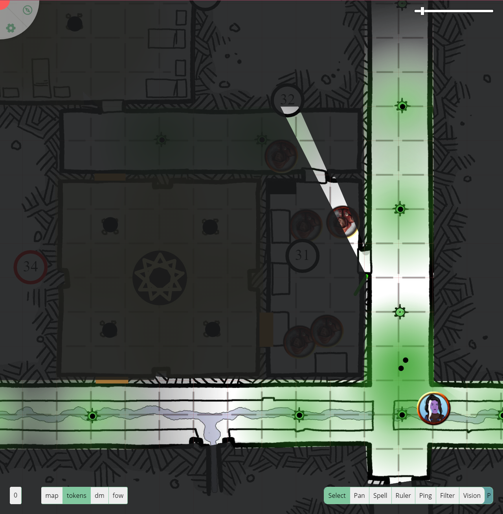

# Game UI

_**Beware** some of the images used throughout this document use content from the WotC published Descent into Avernus. If you are playing in this campaign beware of spoilers._

## A bird's-eye view

The first thing you see when you open a PlanarAlly session is the gameboard and the UI.

Depending on whether you are a regular player or a DM you'll have a vastly different experience.

As can be seen in the following image, players see the board mostly filled with fog in a colour of their choice.
Additionally there are by default 3 UI elements visible, starting from the topleft in counterclockwise rotation we have a button to open the sidemenu, a slider to control the zoom level and a toolbar.

 _Sample Player UI_

The DM has a more specialised view. They can choose the opacity of the fog, allowing them to see what is ahead.

They have slightly more UI tools. The element in the topleft has an additional button to open a bar at the top to change between locations. Additionally there is now also a UI element in the bottom left, which is used to swap between layers and also allows them to create/manage different floors.

 _Sample DM UI_

## Behind the cover of night

Additionally there are a couple of UI elements that only appear after some interaction.
As already mentioned the topleft UI element opens sidebars, but there is also extra UI that appears when selecting a shape or when you select a particular tool that can be configured (e.g. colour selection during drawing).

This tutorial will briefly go over some of these UI elements, but for more in-depth explanations you can visit the player references in the [docs](/docs).

It's possible to hide all UI elements (except the board) with `ctrl+u`. For other keyboard shortcuts check the [quick reference](/docs/reference/).
