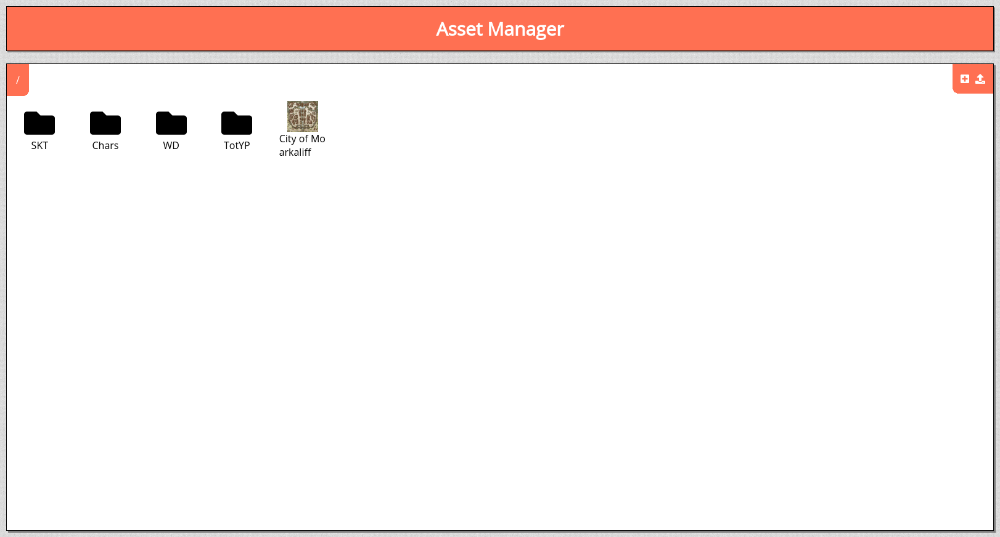

# Asset manager

An important aspect of any VTT is the ability to allow users to use the maps and/or tokens they want.

In PlanarAlly all management of these assets is done via the asset manager and can be found by clicking the popup button on the in-game assets tab.
You can also access it manually by going to `/assets`. _(Ideally this becomes more easily accessible from the main page in the future)_.

When you open it you're visited with a page that acts as a simplified file exlorer:

You can drag and drop items and/or folders into other folders to move them around, you can drag new images from your computer straight on this page to upload them or you could click the upload button in the top right.

The [+] button is there to create a new folder.